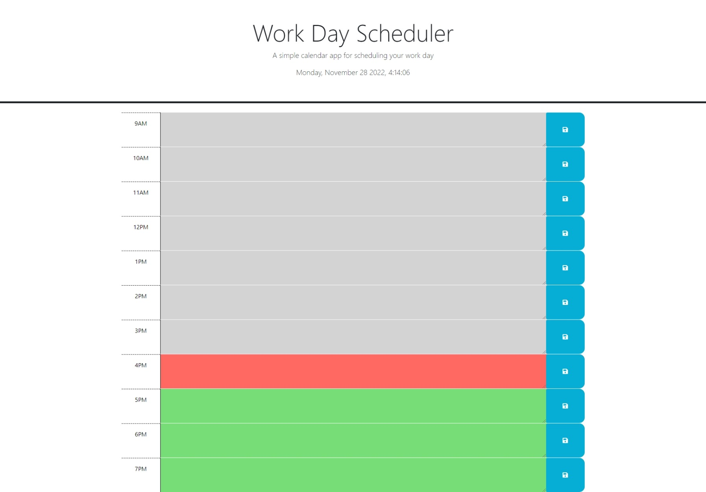
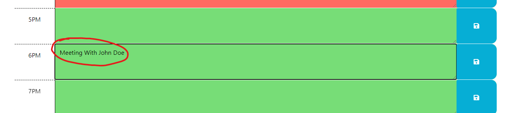
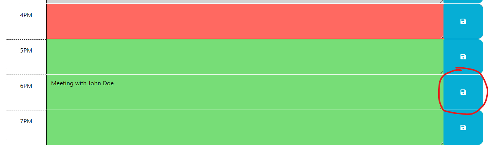
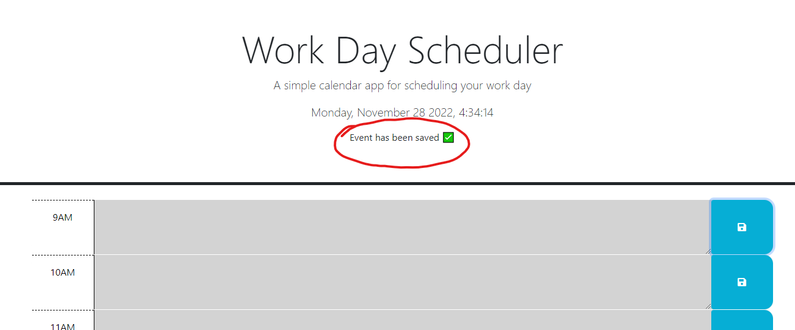

# Event Scheduler

  

## Description

This is a daily event scheduler web app created by me (Gustavo Carrillo) with the aim to schedule events for my working hours. It will save the events scheduled and will display them when the web page is refreshed. One thing of note is that it resets every new day. This web shows my ability to user 3rd party APIs as well as my JavaScript, CSS, and HTML proficiency.

## Links

- [Event Scheduler](https://0zrk23.github.io/event-scheduler/)
- [Event Scheduler Repo](https://github.com/0zrk23/event-scheduler)

## Usage

This webpage is fairly simple and intuitive to use. To get started, click on one of the hour blocks you wish to schedule an event and type what the event is. For example, you can click on the 6PM hour block and type "Meeting with John Doe"

  

To save the event, click on the save button adjacent to the event you just typed. In the case of this example, it would be the save button of the 6PM hour block. When you do, it will display "Event has been saved" near the top of the webpage.

  

  

## Credit

- Credit to the jQuery API
- Credit to the Day.js API

## License

Refer to the license on GitHub